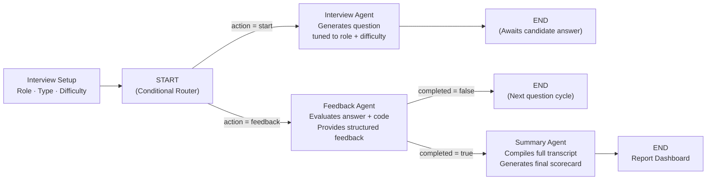
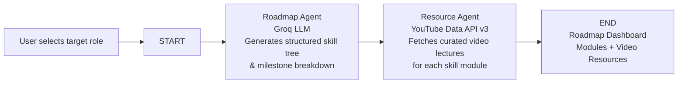

# 🚀 HireSprint

### Autonomous AI-Powered Hiring & Interview Platform

A production-grade full-stack application that eliminates the bottleneck of conducting technical interviews — companies can run real autonomous screening interviews at scale, while candidates can sharpen their skills with AI-powered mock sessions, resume intelligence, and personalized career roadmaps.

[](https://github.com/summar22/HireSprint)
[](https://react.dev)
[](https://nodejs.org)
[](https://langchain-ai.github.io/langgraph)
[](https://mongodb.com)
[](https://redis.io)
[](https://razorpay.com)
[](LICENSE)

---

## ✨ Introduction

HireSprint is a **production-grade, microservices-driven AI hiring ecosystem** built to serve two sides of the hiring table.

Rather than building another chatbot quiz tool, HireSprint orchestrates multiple specialized LangGraph agents that manage the entire interview lifecycle — generating questions tuned to the candidate's role and difficulty level, evaluating live code in a Monaco editor, adapting follow-up questions based on answers, and producing a granular multi-dimensional scorecard at the end.

Built with a distributed Express.js microservices backend, LangGraph multi-agent state machines, MongoDB + Redis data layer, and a React 19 + Vite frontend with voice synthesis and speech recognition.

---

## 💡 Why HireSprint?

The traditional hiring process is broken on both sides.

**For hiring teams**, senior engineers spend hundreds of non-billable hours running repetitive first-round screenings. Back-and-forth scheduling delays hiring cycles by weeks, and interviewer fatigue introduces inconsistency and bias into evaluations.

**For candidates**, ATS filters silently discard resumes with zero feedback, and realistic technical interview practice is hard to access without mock partners or paid platforms.

HireSprint was built to close both gaps. Instead of just recording responses, it actually conducts the interview — asks contextual follow-up questions, evaluates live code, scores communication quality, and delivers an actionable report the moment the session ends.

The result is a tool that compresses the entire initial screening pipeline into minutes — and makes fair, consistent, objective hiring accessible to any team, at any scale.

---

## 🚀 What Makes HireSprint Different?

### 🎙️ Real & Mock Dual-Purpose Interview Chamber
Not just a rehearsal app — HireSprint is built to conduct **real candidate screenings**. Companies can run first-round technical and HR interviews autonomously, 24/7, at any scale. Candidates can use the same system for realistic mock practice. Both modes use the same voice-to-voice engine, live code editor, AI avatars, and state-machine question flow.

### 🤖 Multi-Agent LangGraph Orchestration
Not a single prompt — a pipeline of specialized state machines. The `StateGraph` manages three dedicated nodes: the **Interview Agent** that generates and delivers questions, the **Feedback Agent** that evaluates each answer in real time, and the **Summary Agent** that synthesizes the full session into a scorecard. Each agent has a single responsibility and routes conditionally based on session state.

### 💻 Live Monaco Code Editor & Real-Time Assessment
Candidates solve coding challenges inside a synchronized Monaco Editor — the same engine that powers VS Code. The technical agent generates problems calibrated to role and difficulty level, and the feedback agent evaluates the submitted solution for correctness, logical approach, and edge case handling.

### 📄 AI Resume Builder & ATS Evaluator
Upload a PDF resume for instant parsing and semantic ATS scoring, or build one from scratch with real-time preview and exportable ATS-compliant templates. The resume agent identifies missing keywords, structural gaps, and compatibility issues against the target role.

### 🗺️ Career Roadmap Engine + YouTube Integration
A two-agent LangGraph pipeline generates structured, milestone-based learning paths for any target role. The Roadmap Agent creates the skill tree; the Resource Agent queries the **YouTube Data API v3** to surface curated, high-rated video lectures for each module.

### 💳 Token Credit Economy & Razorpay Billing
A dedicated billing microservice handles Razorpay order creation, payment verification, webhook processing, and credit ledger management. Tokens are consumed per interview session and resume evaluation.

---

## 🌟 Core Features

| 🎙️ Interview Engine | 💻 Technical Assessment |
|---|---|
| Real & Mock interview modes | Monaco Code Editor (VS Code engine) |
| Voice-to-voice interaction (Web Speech API) | Role & difficulty-tuned coding problems |
| AI video avatars (Male & Female) | Live code evaluation & feedback |
| HR behavioral + technical + coding rounds | Adaptive follow-up question generation |
| Session timer & question pacing | Full transcript & code capture |

| 📄 Resume & ATS Suite | 🗺️ Career Growth |
|---|---|
| PDF resume parsing & semantic analysis | AI career roadmap generator (LangGraph) |
| ATS compatibility scoring & keyword gaps | YouTube-curated learning resources per module |
| Drag-and-drop resume form builder | Role-specific skill tree breakdown |
| Real-time ATS template preview | Milestone-based structured learning path |
| PDF export | Progress tracking per roadmap module |

---

## 🏗 System Architecture

```mermaid
flowchart TD
    A["Candidate / Company\n(Browser)"] --> B["React 19 Frontend\nVite — Port 5173"]
    B --> C["API Gateway\nExpress — Port 8000\nAuth Guard + CORS"]
    C --> D["Auth Service\nPort 5001\nFirebase Admin SDK"]
    C --> E["Interview Service\nPort 5003\nLangGraph State Machine"]
    C --> F["Resume Service\nPort 5002\nPDF Parser + ATS Agent"]
    C --> G["Roadmap Service\nPort 5004\nLangGraph + YouTube API"]
    C --> H["Billing Service\nPort 5005\nRazorpay SDK"]
    E --> I["LangGraph StateGraph"]
    I --> J["Interview Agent\nQuestion Generation"]
    I --> K["Feedback Agent\nAnswer Evaluation"]
    I --> L["Summary Agent\nFinal Scorecard"]
    G --> M["Roadmap Agent\nSkill Tree Builder"]
    G --> N["Resource Agent\nYouTube Curator"]
    D & E & F & G & H --> O[("MongoDB\nPersistence")]
    D & E & F --> P[("Redis\nCache & PubSub")]
```

---

## 🤖 Interview Agent Pipeline Flow



---

## 🗺️ Roadmap Agent Pipeline Flow



---

## 🛠 Tech Stack

### Frontend
- **Framework:** React 19, Vite
- **Styling:** Tailwind CSS, Framer Motion
- **State Management:** Redux Toolkit
- **Code Editor:** Monaco Editor (`@monaco-editor/react`)
- **Authentication:** Firebase Client SDK
- **Voice:** Web Speech API (STT + TTS)
- **Charts:** Recharts

### Backend Microservices
- **Architecture:** Distributed Express.js Microservices with API Gateway
- **AI Orchestration:** LangChain, LangGraph `StateGraph`, Groq SDK (Llama 3 / Mixtral)
- **Databases:** MongoDB with Mongoose ODM, Redis (ioredis)
- **Document Processing:** `pdf-parse`, `multer`
- **Payments:** Razorpay Node.js SDK
- **Integrations:** YouTube Data API v3, Firebase Admin SDK

---

## 📁 Repository Structure

```
HireSprint/
├── backend/
│   ├── docker-compose.yml              # Redis infrastructure
│   ├── gateway/                        # API Gateway — auth guard + reverse proxy
│   │   ├── controllers/                # User context & session
│   │   ├── middleware/                 # isAuth Firebase token verification
│   │   └── utils/                      # Proxy header forwarding
│   ├── services/
│   │   ├── auth/                       # Firebase auth & MongoDB user profiles
│   │   ├── billing/                    # Razorpay orders & token credit ledger
│   │   ├── interview/                  # LangGraph multi-agent interview engine
│   │   │   ├── agents/                 # Interview, Feedback & Summary agents
│   │   │   ├── graph/                  # StateGraph, conditional router, state schema
│   │   │   └── prompts/                # HR, Technical & Feedback prompt templates
│   │   ├── resume/                     # PDF parsing, ATS scoring & resume agent
│   │   └── roadmap/                    # LangGraph roadmap + YouTube resource agent
│   └── shared/
│       └── redis/                      # Shared Redis client
└── frontend/
    └── src/
        ├── apis/                       # Axios service clients per microservice
        ├── assets/                     # AI avatar videos (male/female)
        ├── components/
        │   ├── interview/              # Step1Setup, Step2Interview, Step3Report, Timer, CodeEditor
        │   ├── resume/                 # ATSTemplate, ResumeForm, PreviewResume, DownloadBtn
        │   └── roadmap/                # ModuleCard, RoadmapResult
        ├── pages/                      # Home, Dashboard, InterviewStart, InterviewPage,
        │                               # InterviewReport, ResumeBuilder, Scorer, Roadmap, Billing
        ├── redux/                      # resumeSlice, store
        └── utils/                      # axios instance, firebase config
```

---

## ⚡ Getting Started

### Prerequisites
- Node.js v18+
- MongoDB (local or Atlas)
- Redis (local or Docker)
- Groq API Key — [console.groq.com](https://console.groq.com)
- Firebase Project — [firebase.google.com](https://firebase.google.com)
- Razorpay Account — [razorpay.com](https://razorpay.com)
- YouTube Data API v3 Key — [console.cloud.google.com](https://console.cloud.google.com)

### 1. Clone the Repository
```bash
git clone https://github.com/summar22/HireSprint.git
cd HireSprint
```

### 2. Configure Environment Variables
```bash
cp backend/gateway/.env.example            backend/gateway/.env
cp backend/services/auth/.env.example      backend/services/auth/.env
cp backend/services/billing/.env.example   backend/services/billing/.env
cp backend/services/interview/.env.example backend/services/interview/.env
cp backend/services/resume/.env.example    backend/services/resume/.env
cp backend/services/roadmap/.env.example   backend/services/roadmap/.env
cp frontend/.env.example                   frontend/.env
```

### 3. Start Infrastructure
```bash
cd backend && docker-compose up -d
```

### 4. Run Backend Services
```bash
cd backend/gateway            && npm install && npm run dev   # :8000
cd backend/services/auth      && npm install && npm run dev   # :5001
cd backend/services/billing   && npm install && npm run dev   # :5005
cd backend/services/interview && npm install && npm run dev   # :5003
cd backend/services/resume    && npm install && npm run dev   # :5002
cd backend/services/roadmap   && npm install && npm run dev   # :5004
```

### 5. Run Frontend
```bash
cd frontend && npm install && npm run dev
```

Open [http://localhost:5173](http://localhost:5173)

---

## 🔒 Environment Variables Reference

| Variable | Service | Description |
|---|---|---|
| `PORT` | All | Service port number |
| `MONGODB_URL` | Auth, Billing, Interview, Resume, Roadmap | MongoDB connection string |
| `REDIS_URL` | Gateway, Auth, Interview, Resume | Redis connection URL |
| `GROQ_API_KEY` | Interview, Resume, Roadmap | Groq LLM inference API key |
| `YOUTUBE_API_KEY` | Roadmap | YouTube Data API v3 key |
| `RAZORPAY_KEY_ID` | Billing | Razorpay public key |
| `RAZORPAY_KEY_SECRET` | Billing | Razorpay secret key |
| `VITE_FIREBASE_APIKEY` | Frontend | Firebase web client API key |
| `VITE_BACKEND_URL` | Frontend | API Gateway base URL |
| `VITE_RAZORPAY_KEY_ID` | Frontend | Razorpay client-side key |

---

## 📜 License

Distributed under the MIT License.

---

Built with ❤️ by [summar22](https://github.com/summar22)
